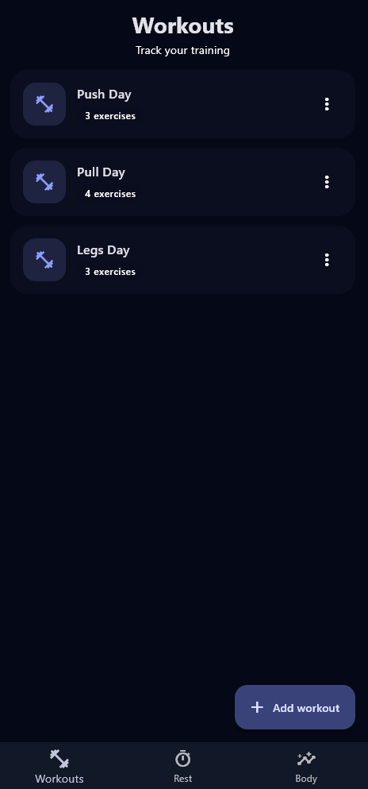
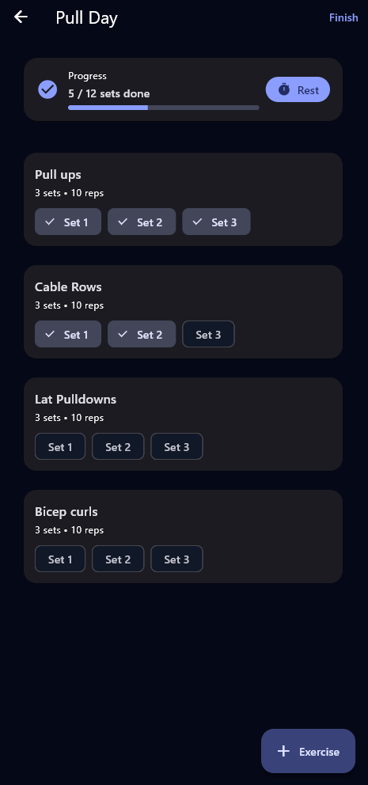
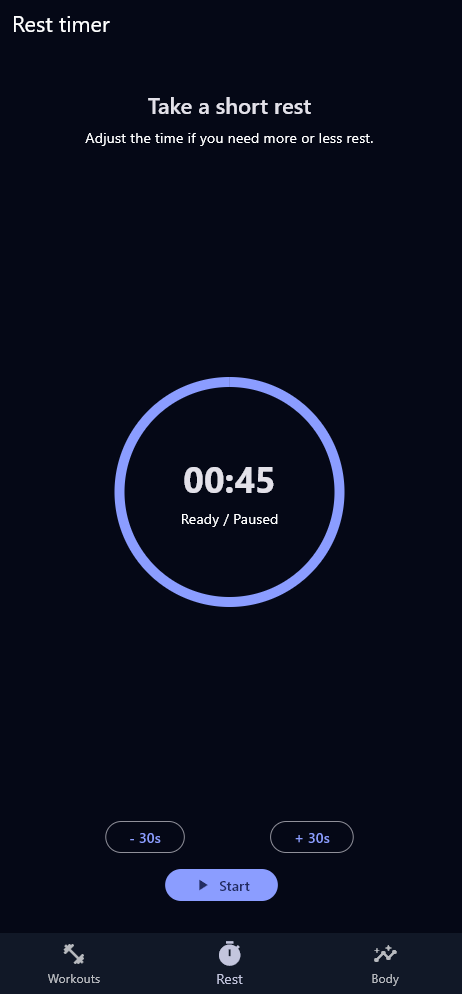
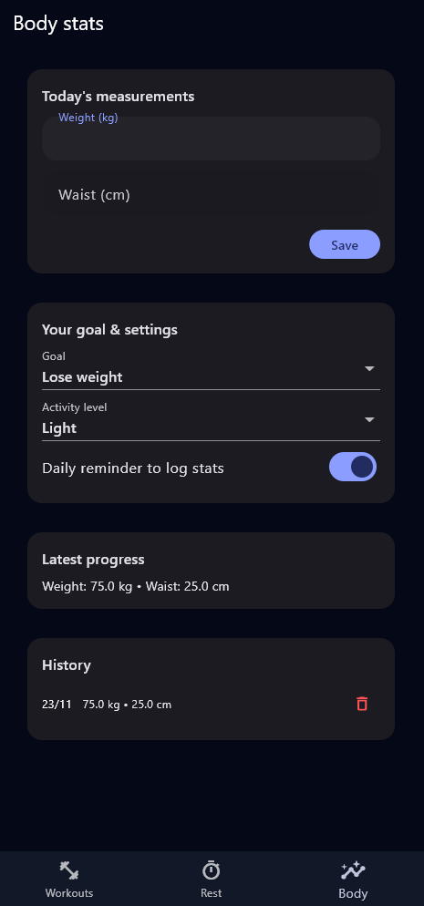

# MyFitnessPal Application

### CSCI 410 Project – Mobile Development
A modern and simple workout-tracking app built with Flutter.

This application helps users manage their workout routines, track body stats, and use a built-in rest timer for efficient gym sessions.

---

## Features
- Custom workout splits
- Exercise lists
- Rest timer with animations
- Body stats tracking (weight, waist, etc.)
- Clean dark theme design

---

## Team Members
**Mohammed Osman**  
**Ali Lamaa**

---

## Preview

  
  
  

  

---

